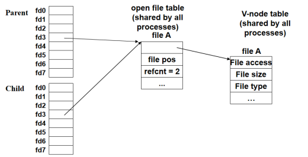
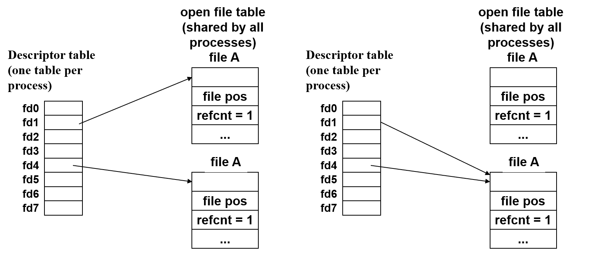

# I/O

[TOC]

### 一、概念

#### 1. 理解

IO分成标准IO（高层级的用户级IO）、UnixIO（由kernel直接提供，在syscall上直接进行处理）。

**抽象**：将所有输入输出设备抽象为**文件**。默认打开的文件：屏幕和键盘。把所有外接设备的交互过程作为**字符串**。输入就是接受一个byte，输出就是写一串byte。

在IO设备上，最重要的就是read和write这个syscall。包括网络、磁盘、终端设备都是用这个。

**文件**：抽象为一个byte流

* regular文件（普通的文本文件）

  * Text file：可以用asc2码编码
  * Binary file：二进制文件。

* 目录文件：存放一系列的链接，操作系统解释成文件的指针。

  mkdir、ls、rmdir都是可执行文件，是前人写好的东西，属于IO相关的编程。

* socket：跨网络通信文件

#### 2. 数据结构

**文件描述符fd**：非负int，descriptor table中的下标，table里存放指针，指向文件信息。

* fd0：stadin；fd1：stdout；fd2：stderr

**open file table**：记录读取的位置pos，以及使用者数量refcnt（refcnt=0，可以回收）。

vnode table：静态信息，文件创建的时候就有了。进程哪怕关掉了文件还会存在。


其中只有第一个结构是每个进程独一份，其余都是共享的。


Fork

* descriptor table是一份和父进程一样的副本
* 共享同一个open file（进程之间的共享）
* kernel维护refcnt++



#### 3. 文件操作

```c
// ssize_t:有符号整数
// size_t:无符号整数

// 成功返回新文件描述符，出错-1
// flag：如何访问（只读、只写...
// mode：访问权限
// 每次打开创建一个文件表
int open(char *filename, int flags, mode_t mode);

// 成功0，出错-1
int close(int fd);

// 成功返回度的字节数，只读到EOF返回0，出错-1
// 读最多n个byte到buf中
ssize_t read(int fd, void *buf, size_t n);

// 成功则为写的字数，出错-1
ssize_t write(int fd, const void *buf, size_t n);

// 读文件的metadata，只能通过unix io实现
// 访问vnode，可以不打开文件
int stat(const char *filename, struct stat *buf);
int fstat(int fd, struct stat *buf) ;

//重定向，dup2(4,1)表示把标准输出fd1对应到fd4指向的地方
int dup2(int oldfd, int newfd);
```



<center>dup2(4,1)</center>


Short count问题：

* read读到了EOF
* 从终端读入
* syscall打断了read
* 读写socket：网络延迟等


#### 4. RIO健壮读写

终端设备和网络上不能使用std io，syscall过长可能被signal打断（short count）。

##### 无缓冲

内存直接到文件。unix IO就是无缓冲的

`rio_readn` `rio_writen` p899

如果没读完，while循环回去继续读

##### 带缓冲

rio_readlineb：先判断buffer是否已经空了

* buffer非空
  * 要读的比buffer大，直接返回整个buffer。
  * 想读的比buffer小，返回对应的值。
  * 把buffer数据copy到内存中
  * 然后调整pointer和rio_cnt（buffer中剩余的数量）

* buffer为空
  * 从disk中读取buffer size的数据（自动）
  * pointer指向开头，cnt设置为新填入的数据数量。

#### 5. Standard I/O

抽象为：stream。不太会返回到读过之前的东西，更适合网络

提供了完整缓冲区的功能：写操作会等凑够一定的数量才会写到disk中。

> \n是printf缓冲区的一个刷新条件，还有定时刷新、强制刷新（fflush）

#### 6. 选择

rio和标准io都是基于unix io实现的

* unix I/O
  * 所有功能都可以完成，low level。理论上单次io操作，overhead是最小的。
  * 检查metadata：只有unix io提供了检查接口。（fstatus不属于std I/O，属于unix I/O）
  * 异步安全的，**在signal handler里面只能使用unix I/O**。
  * 实现很脆弱很敏感，代码复杂，容易出错。 

* std io
  * 支持缓冲区，在一系列操作的时候性能更好。
  * 支持general的操作。比如支持变参数的函数（printf）
  * 不是signal-safe的，不能访问metadata。
  * 加了缓冲，不太适合网络的操作。

> read buffer和write buffer是两个buffer。又读又写时，如果write缓冲区没有刷新，紧跟了一个read，可能会读到旧数据。建议避免，或者加上fflush。
>
> 在一个网络流上同时进行读写。需要把这个网络流打开两次，把fd打开两次，有两个数据结构，close的时候，可能会把一个文件close两次。

**规则**：

* 尽可能使用high-level的io。
* 遇到signal和metadata的情况，只能使用unix io。
* 不要用scanf或rio_readlineb读二进制文件：可能有很多0xa但是并非终止

### 二、习题

#### 1.

```cpp
int main()
{
   int fd1, fd2, fd3;
   char *buf1 = (char *)malloc(10);
   char *buf2 = (char *)malloc(10);

   fd1 = open("a.txt", ORDWR, 0);
   fd2 = open("b.txt", ORDWR | O_APPEND, 0);
   fd3 = open("a.txt", ORDWR, 0);

   if (fork() == 0) { // 子进程移动了光标
      read(fd2, buf1, 2); // buf1:"01"
      dup2(fd1, fd2);// fd2 -> a.txt 这个对父进程不影响
      read(fd2, buf1, 1); // buf1:"a"
      exit(0);
   }

   waitpid(-1, NULL, 0);
   read(fd2, buf1, 3); // buf1:"234"
   write(fd1, buf1, 3); //a.txt:"a234efg"从光标位置覆盖3个
   read(fd1, buf1, 10); // buf1:"efg" short count
   printf("%s \n", buf1); // "efg"
   read(fd3, buf2, 10); //buf2:"a234efg" 另一个file table光标在开头
   dup2(fd2, 1); // 1:stdout
   printf("%s \n", buf2); // 这里输出到fd2,b.txt的模式是append，写在末尾

   free(buf1);
   free(buf2);
   exit(0);
}
```

a.txt：abcdefg

b.txt：0123456789

1. What will the contents of a.txt and b.txt be after the program completes? 

   a.txt: **a234efg** b.txt: **0123456789a234efg** 

2. What will be printed on stdout? 

   **efg**

