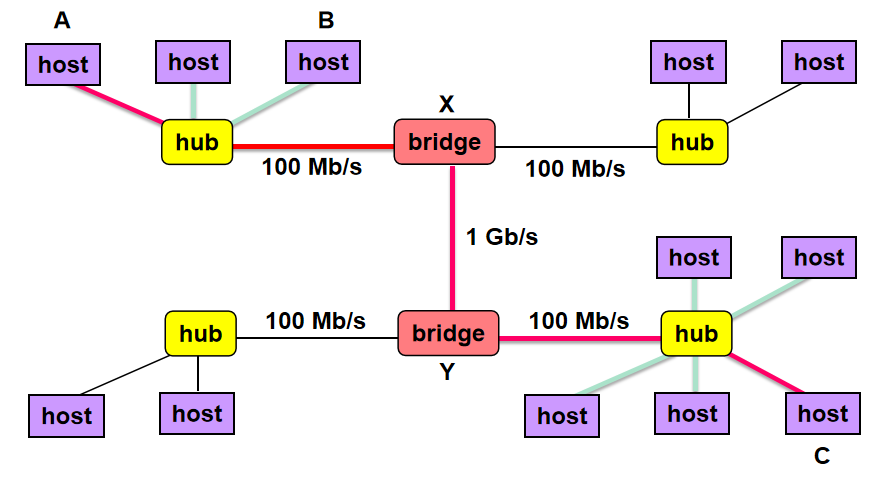
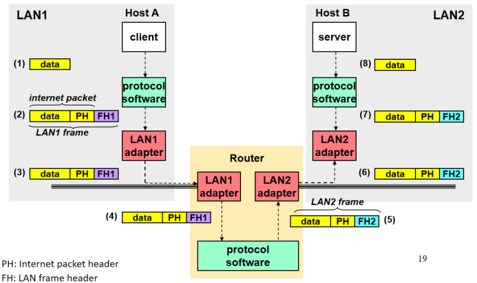
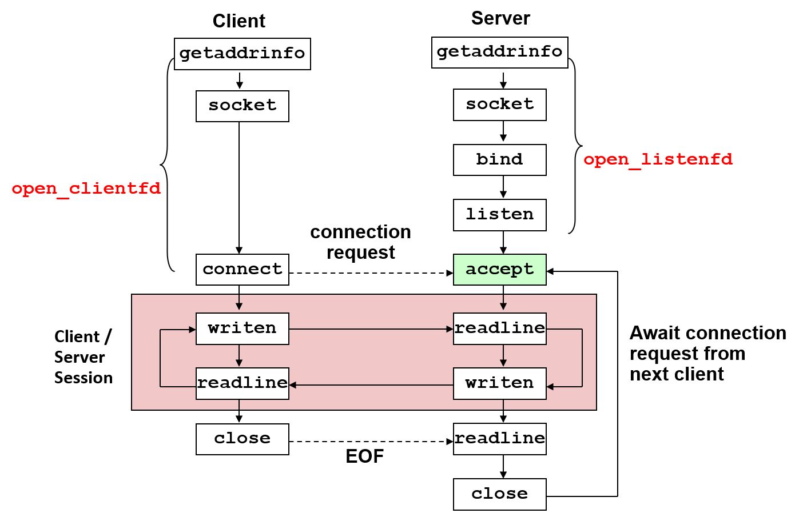

# Web

[TOC]

### 0. 理解

 网络从硬件上来说是io的一部分，可以input、output，机器上插的叫做网卡（network adapter）

**client-server**：当前最主流的网络编程模式。client是访问资源的人，server就是掌握资源的人。有很多client寻求server的帮助。

* 网页小程序、ftp都是cs模型。单机中，图形化界面中屏幕显示就是server。
* client和server都是进程。以**request**进行传递，限定接口，约定好interface。所以是松耦合：可以自己进行优化。

### 1. 网络层级结构

**网络**：一个层级结构，网络越往下越low level

* Lowest level：**局域网LAN**（local area network）。LAN一般按照building或者校园为单位。

* 最流行的局域网技术：**以太网（Ethernet）**。可以看成协议标准。
  * **集线器（hub）**：就是把host连在一起的设备。
  * **端口(port)**：hub提供的口，连接主机host
  * 广播：hub收到一个request，广播给连在上面的所有host。缺点：不可扩展，如果数百台机器连在上面，有效消息只有百分之一。
  * 每个插上以太网的设备都会有一个**48位的以太网mac地址**。
  * 发送的消息单位叫做**帧（frame）**。每个frame包含固定大小的header（标识：源、目的地址、帧长），以及有效荷载payload
* 在hub上有**bridge**。根据header发送给某个hub。用一套协议，一个国家。



* **路由器（router）**：链接不同协议的网络。路由器中可以加入防火墙、检查等功能。
  * 主要翻译的是header，不管payload
  * 传递的是网络包package
* 通过router连成一个internet


### 2. TCP/IP

* 命名机制naming scheme：一致的主机地址格式，标识主机
* 传输机制delivery mechanism：传递packet（header+payload），header可以嵌套




1. client A发送给kernel：kernel中protocol software包装。外部是LAN frame，内部是internet packet（在LAN中只要认识外层的LAN）
2. 把frame发送到LAN，发送给对应的Router
3. Router将消息换一个header：根据内部的internet packet，读出destination，换掉图中紫色的FH1
4. 发送给对应LAN，找到对应机器，发给对应kernel，kernel取出payload

对于过大的文件需要切割。

**IP地址**

* 32-bit
* map to域名domain names：0xca7828bc is mapped to  ipads.se.sjtu.edu.cn 
* 0xca7828bc = 202.120.40.188
* **Big-endian**


### 3. Berkeley socket interface

#### 数据结构

```c
/* Internet address */
struct in_addr {
  uint32_t s_addr; /* 32-bit IP address */ 
};

/* IP socket address structure*/
struct sockaddr_in  {
  uint16_t sin_family; /*Address family (AF_INET) */
  uint16_t sin_port;   /*Port number*/
  struct in_addr  sin_addr;   /*IP address*/
  unsigned char sin_zero[8];   /*Pad to “sockaddr”*/
};

/* 另一种形式 */
struct sockaddr {
  uint16_t sin_family;  /*Protocol family*/
  char     sa_data[14]; /*address data*/
};
typedef struct sockaddr SA;
```

#### 流程



1. **open_clientfd**
   1.  getaddrinfo：将主机名、主机地址、服务名和端口号的字符串转化成socket地址结构。
   2. socket：创建一个套接字描述符(socket descriptor)。但是返回的clientfd描述符只是部分打开的，还不能用于读写。
   3. connect：尝试与地址addr的服务器建立internet连接。Connect函数会阻塞，直到建立连接或者出错。
2. **open_listenfd**
   1. 同样转换地址创建socket
   2. bind：让内核将addr中的服务器socket地址和描述符sockfd联系起来。用getaddrinfo来为bind提供参数。
   3. listen：将sockfd从一个主动套接字转化为一个监听套接字(listening socket)，可以接受客户端的连接请求。
   4.  accept：等待连接请求到达监听套接字listenfd，然后在addr中填写客户端的socket addr，返回一个已连接描述符(connected descriptor)，这个描述符可被用来使用Unix I/O函数与客户端通信。
3. **通讯**：红色部分
   1. 途中各自只有两个操作，读和写。需要约定好，发过去对面要及时接收。
   2. C/S会话结束了以后，client就关闭了。
   3. server端循环到上面，由于client会随时发请求，所以server端一直会有这个进程（叫做daemon process，守护进程），等待新的请求。accept有点像waitpid函数的行为，如果没有client请求就会一直等下去。

### 4. HTTP协议

#### URL

静态内容

http://ipads.se.sjtu.edu.cn:80/courses/ics/index.html
http://ipads.se.sjtu.edu.cn:/courses/ics/index.html
http://ipads.se.sjtu.edu.cn/courses/ics/

动态：传参

http://www.cs.cmu.edu:8000/cgi-bin/adder?15000&213

URL不能有空格，会被转化成%20

* 前缀
  * 类型http://
  * server：ipads.se.sjtu.edu.cn
  * 端口（可不写）：80

* 后缀
  * 类似寻找文件，第一个/是工作目录（相对路径）

#### Request

* **Request line**: <method> <uri> <version>
  * method：GET, POST, OPTIONS, HEAD, PUT, DELETE, or TRACE. 
  * version：HTTP版本 (HTTP/1.0 or HTTP/1.1)
* **Request headers**: <header name>: <header data>

#### Response

* Response line: <version> <status code> <status msg>
  * status code：一个数字
  * status msg：英文
* Response headers: <header name>: <header data>
  * Content-Type
  * Content-Length：response-body的大小

### 习题

#### 1.

Assume we want to write a tick program which **prints a ”BEEP” in console every second**. If there is any client connected, the BEEP will be **sent to client** instead of being printed on server. When client closes the connection, ”BEEP” should be printed in console again. Here is part of the program: 

```cpp
void handler(int sig) {
    write(1, "BEEP\n", 5); // 把BEEP写到stdout
    alarm(1);
}

// This function will block and return
// After the client closes the connection
void wait_disconnect(int fd) {
    char c;
    while (read(fd, &c, 1) > 0 || errno == EINIR);
}

int main(void) {
    int listenfd, connfd;
    // You are not allowed to use stderr
    close(2);
    signal(SIGALRM, handler);
    alarm(1);
    listenfd = open_listenfd(1234);
    while (1) {
        connfd = accept(listenfd, NULL, NULL); // 直到有client连接
        /* Answer start */
        int stdout_backup = dup(1); // 备份描述符stdout
        dup2(connfd, 1);
        wait_disconnect(connfd); //直至连接关闭
        close(connfd); //及时close
        dup2(stdout_backup, 1); //重新输出到console
        close(stdout_backup); // 及时关闭备份，避免描述符泄漏：备份和stdout指向一个地方
        /* Answer end */
    }
    exit(0);
}

```

#### 2.

Suppose a tiny web server that can serve dynamic contents to the clients. The server has different executable files to serve different client requests. The following code shows the core function that handles dynamic contents, along with a CGI program that queries a student’s lab score: 

```cpp
void serve(int fd, char* host, char* exe, char* qStr) {
    // Omit HTTP response header construction
    if (fork() == 0) {
        setenv("QUERY_STRING", cgiargs, 1); 
        __[1]__
        __[2]__
        execve(exe, {NULL}, environ);
    }
    Wait(NULL);
}

int main() {
    int score;
    if (strcmp("10.0.0.2", __[3]__) != 0) {
        fprintf(stderr, "Invalid IP!\r\n"); fflush(stderr);
        exit(1);
    }
    // Omit score querying logic
    fprintf(stdout, "Score:%d\r\n", score);
    fflush(stdout);
    exit(0);
}
```

Assumptions:

* All executable files reside in the cgi-bin directory on the server, and the server uses the same strategy to parse requests in section 11.6 of our textbook.
* For function serve, parameter fd is a connected descriptor with client, host is the host name of the client, exe is the CGI program name to execute and serve the request, qStr is the query string of the request. 
* Function strcmp at line 14 returns 0 if two parameter strings are the same.
* “␣ ” symbol represents a whitespace character. 

Now suppose a student issues an http request to the server via his browser, the URL is:

```c
http://ipads.se.sjtu.edu.cn/cgi-bin/labgrade.cgi?student_id=100␣ &lab=9 
```

1. Does the above URL contain valid arguments? (2’) If not, please describe how to correct it. (2’) (Hint: refer to section 11.5 in our textbook)

  **No, 不允许有空格。将空格替换成‘%20’** 

2. For the above URL (correct it if you think it is not valid in the previous problem), what is the name of the executable file that serves the request in web server? (2’) What are the arguments? (2’)

  **可执行文件：labgrade.cgi**

  **参数（？后面的）：student_id=100␣ &lab=9** 

3. Our lab score querying CGI program only serves requests issued from the host  “10.0.0.2” (As Line 14-17 shows, other hosts will be rejected and prints an error message), please fill code in the blanks of [1] and [3] that pass necessary parameters (between server process and CGI program process) to achieve this check. (4’)

  ```cpp
  setenv("REMOTE_HOST", host, 1); //[1]
  getenv("REMOTE_HOST"); //[3]
  ```

  

4. Fill necessary code in the blank of [2] to ensure **all possible writes** in the CGI program (Line 15 and 19) goes directly to the client. (4’) (Hint: the number of statements a blank can write is not limited)

  ```cpp
  Dup2(fd, stdout); Dup2(fd, stderr);
  ```

  

