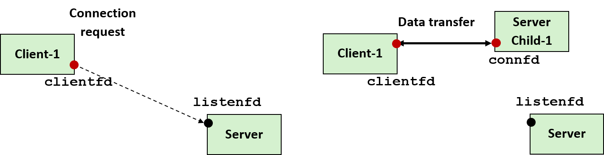
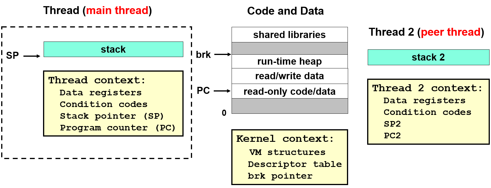
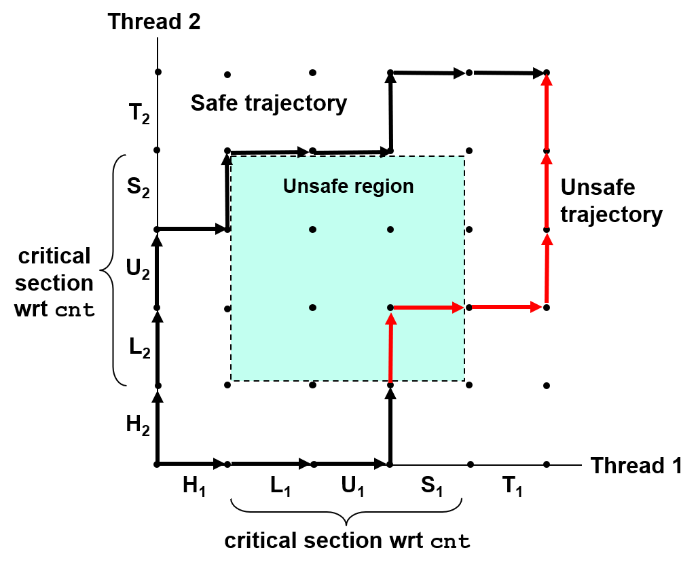
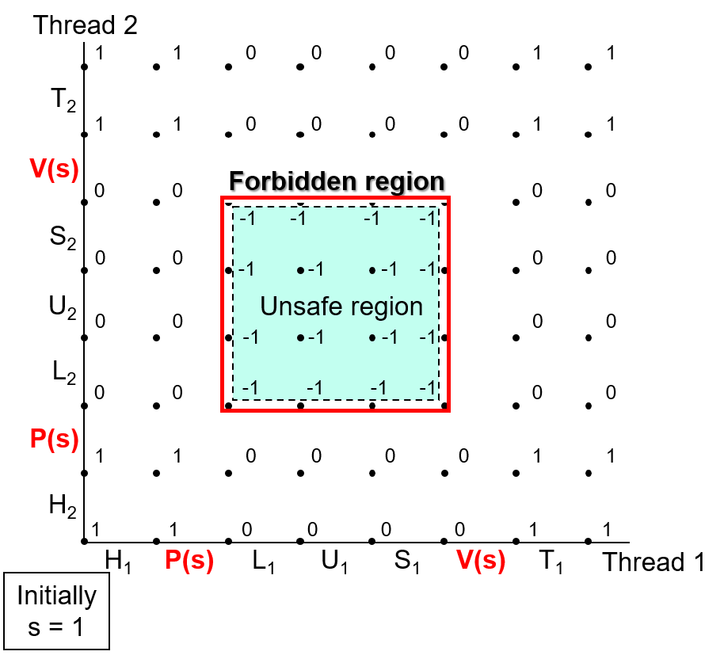
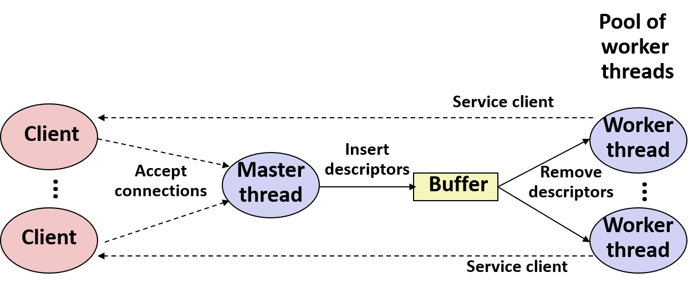
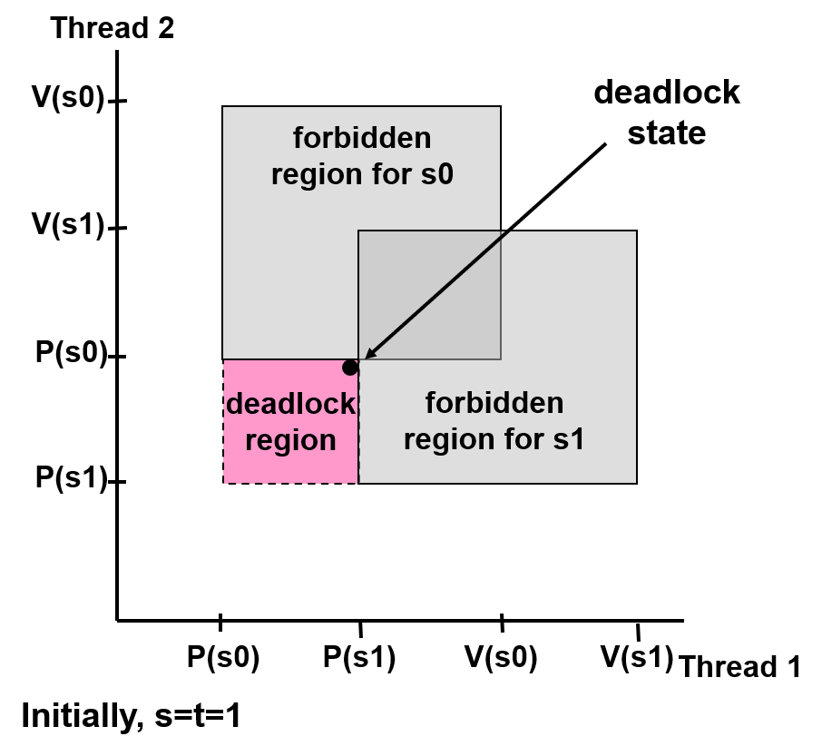
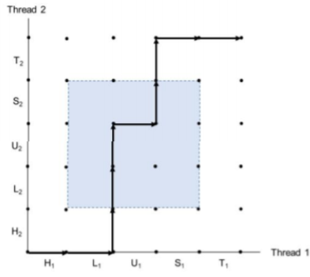
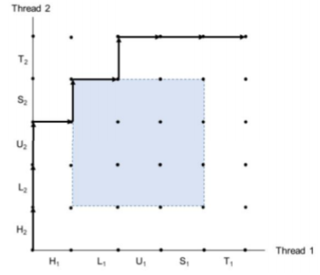
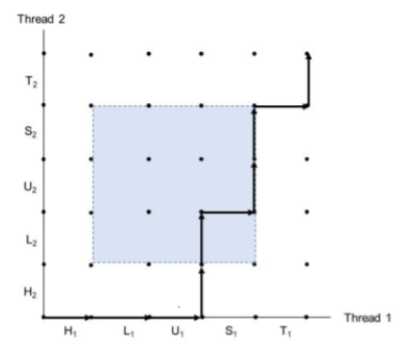
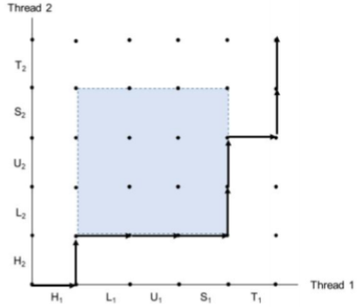

# Concurrent Programming

[TOC]

> D. Butenhof, “Programming with Posix Threads”, Addison-Wesley, 1997

### 一、理论

#### 0. Motivation

并行的好处：

1. 处理异步事件。不知道什么时候回来，如handler
2. 支持多CPU的使用，利用更多的资源。
3. 解决异步设备（I/O设备）读写慢的情况
4. 和用户打交道。输入较慢，不干等
5. 网络如果串行，不能解决多人的情况。OS定时轮询不同的程序，进行分配（进程调度，不希望慢的操作把快的操作挡住了）

并发编程：OS提供一个调度接口，帮我们实现调度。

#### 1. 应用层实现并发的方法

##### 1.1 Process

创建多个进程，实现一个并行的server：有client连接时，就分配一个子进程，丢给子进程去处理。

多进程的方式，只受到操作系统进程数和资源的限制。



* fork后，父子的listenfd，connfd指向同一处
* 先关掉子进程的listenfd：子进程已连接，不再需要
* 关掉父进程connfd：connfd对父进程没有用，父进程不再管该client
* long-running进程的资源要及时回收：连接符fork后有两份，不要用的那份如果不及时回收，之后将永远不会释放已连接描述符的文件表条目entry。
* 用SIG_CHLD回收子进程

共享信息：

* 通过共享file table(显式)
* 不共享地址空间，进程有独立的地址空间

缺点:

* 不轻量（大多数都是短连接）
  * 每个client都要创建一个进程，额外代价大。
  * 进程越多，调度队列长，回收难
* 父子进程共享数据困难。需要IPC（interprocess communication），如FIFO队列，或两个进程映射到同一块共享内存。


##### 1.2 Thread

线程：一个进程里和执行流相关的部分。我们希望线程内独立的部分越小，这样overhead更小。

进程 = process context + code, data, stack


* 一个Context代表了运行的一个程序
* vm structure（OS配的，记录进程相关的内存信息
* brk pointer（堆指针）

Process= **thread** + code, data, and kernel context



* 栈是代表了线程执行的整个不同的过程，所以有自己的stack
* main thread：每个进程至少包括的一个线程（进程开始时）
* 每个线程有自己逻辑的执行流，维护自己的名字（thread id，TID）

线程vs进程：

* 线程也有context switch，但是上下文比进程小得多，切换更快
* 线程没有父子层次，只有对等线程池，读写相同共享数据（进程一般不共享）。可杀死任何对等线程。


Posix标准接口

```c
#include <pthread.h>
typedef void *(func)(void *);

/*
* 成功返回0，出错非0
* 创建并设置tid为线程号，attr配置信息，func为执行的函数，arg为函数参数
*/
int pthread_create(pthread_t *tid, pthread_attr_t *attr, func *f, void *arg);

/* 返回自己的线程号*/
pthread_t pthread_self(void);

/* 
* 不返回
* 如果主线程调用：等待所有对等线程终止后终止，并终止整个进程
*/
void pthread_exit(void *thread_return);

/*
* 成功返回0，出错非0
* 阻塞，等待线程tid终止，回收其内存。必须指定tid
*/
int pthread_join(pthread_tid tid, void **thread_return);

/*
* 成功返回0，出错非0
* 分离线程，不能被其他线程回收、杀死，系统释放内存
*/
int pthread_detach(pthread_t tid);
```

* 线程退出，不要轻易使用exit函数：导致所有的线程全部结束
* 如果没有join，可能main thread先结束，peer thread后结束
* web服务器中，每个线程不需要等待别人终止，一般分离自身。防止main先结束。


```c
/* thread routine */
void *thread(void *vargp)
{
    int connfd = *((int *)vargp); //进行一个cast得到connfd

    Pthread_detach(pthread_self()); //自我分离
    Free(vargp); //所有线程共享一块资源，主进程malloc，可通过子进程free
    echo(connfd);
    Close(connfd); //共享的fd，谁close都一样
    return NULL;
}
int main(int argc, char **argv){
    int listenfd, *connfdp
    socklen_t clientlen;
    struct sockaddr_in clientaddr;
    pthread_t tid;

    if (argc != 2) {
        fprintf(stderr, "usage: %s <port>\n", argv[0]);
        exit(0);
    }
    listenfd = open_listenfd(argv[1]);
    while (1) {
        clientlen = sizeof(clientaddr);
        connfdp = Malloc(sizeof(int));
        *connfdp = Accept(listenfd,(SA *)&clientaddr, &clientlen);
        Pthread_create(&tid, NULL, thread, connfdp);
    }
}

```


缺点：

* 共享资源。如果直接传递connfd没有malloc，该对象可以被多个thread访问。创建出线程以后，main中再次Accept会覆盖掉局部变量connfd。其他线程会突然发现自己的fd变了。所以每次要malloc


##### 1.3 I/O多路复用

I/O多路复用，是有限状态机的思路。在一个线程内部去调度。

**select**（syscall）：

* 监听多个fd（包括listenfd和connfd），当有fd有消息来了的时候，它会从select中退出
* 在一个bitmap中，每一个bit代表一个fd，置1代表要监听

```c
#include <sys/select.h>

/* 
* 返回已经准备好的fd的个数，出错-1
* Maxfd：监听最大数
* Readset：传过去时写好哪些fd被监听，返回哪些有消息
*/
int select (int maxfd, fd_set *readset, NULL, NULL, NULL);

/* clear all bits in fdset. */
void FD_ZERO(fd_set *fdset);
/* clear bit fd in fdset */
void FD_CLR(int fd, fd_set *fdset);
/* turn on bit fd in fdset */
void FD_SET(int fd, fd_set *fdset);
/* Is bit fd in fdset on? */
int FD_ISSET(int fd, *fdset);
```

例子：

```c
    FD_ZERO(&read_set);
    FD_SET(STDIN_FILENO, &read_set);
    FD_SET(listenfd, &read_set);
    while(1) {
        ready_set = read_set;
        Select(listenfd+1, &ready_set, NULL, NULL, NULL); // 可以同时监听多个
        if (FD_ISSET(STDIN_FILENO, &ready_set)
            /*read command line from stdin */
            command();	
        if (FD_ISSET(listenfd, &ready_set)){
            connfd = Accept(listenfd, (SA *)&clientaddr, &clientlen); // 因为有消息了，所以肯定立刻返回
            echo(connfd);
        }
    }
```

实现server：

* 监听所有的listenfd，connfd
* 如果listenfd有消息，拿到新的connfd，加入监听队列
* 如果connfd有消息，服务（并close connfd，remove）
* 需要一个结构体记录状态


缺点：

* 没有利用多核

##### 1.4 总结

开了一家餐馆，想要扩大经营：

* 进程：再开一家店，都有一套完整的东西，开销大，流动麻烦
* 线程：多放几套桌子和服务员
* I/O：雇一个能力强的服务员，不会被阻塞，跑得快。事件驱动，有事就叫服务员，服务员监听事件（select）。（原来是线程切换，现在是服务员技能切换）


#### 2. 共享变量

##### 2.1 概念模型

Process= **thread** + code, data, and kernel context

* 共享的process context
  * code, data, heap, virtual address space
  * open files and installed handlers
* 独有的thread context
  * Thread ID, stack, stack pointer, PC, CC, registers

实际操作中：reg确实严格私有，但是可以访问别人的stack(比如传递了一个全局的指针)

##### 2.2 变量

* 全局Global
  * 只有一个实例，所有线程共享
* 局部Local
  * 用变量名x加线程id：x.id表示实例
* 局部静态Local static
  * 同global，只有一个实例

##### 2.3 共享变量

definition：是否被多个线程引用

共享变量也可能是local (stack上)


#### 3. 同步问题

同步错误：（例）count++在汇编中三条语句Load，update，write；一般问题都在update和write中switch了

##### 3.1 进度图

progress graph：n个线程化为n*n点阵中的一条轨迹线



##### 3.2 semaphore：互斥

semaphore信号量s：

* 非负整数
* global
* 两种原子性操作（不会中断）
  * $P(s)$：[  **while (s == 0)  wait();  s--;** ]
  * $V(s)$：[  **s++;** ]

实现互斥：



##### 3.3 semaphore：调度共享资源

* counting semaphores：记录共享资源状态
* binary semaphores：通知其他threads

###### (1) Producer-consumer


三个信号量

* mutex：binary，互斥缓冲区访问
* slots：count，空位数。非零时producer可以放入
* items：count，物品数。非零时consumer可以放入

###### (2) Reader-writer

1. 偏向reader的

   有writer在等待的时候，新的reader也可以直接进入（read不冲突）

2. 偏好writer的

   一旦writer准备写了，就尽可能快地执行写。在writer到达之后的reader操作必须要等待。

```cpp
int readcnt;    /* Initially 0 */
sem_t mutex, w; /* Both initially 1 */

void reader(void) {
  while (1) {
    P(&mutex); // 保护对readcnt的操作
    readcnt++;
    if (readcnt == 1) // 第一个reader锁门
    	P(&w);  // 只要有reader抢到w，后面的reader不用等
    V(&mutex);
      
    /* Reading here */
      
    P(&mutex);// 保护对readcnt的操作
    readcnt--;
    if (readcnt == 0) // 最后一个reader开门 
    	V(&w);
    V(&mutex);
  }
}
void writer(void) {
  while (1) {
    // writer没有排队
  	P(&w); // 可能reader源源不断的，writer就starvation
    /* Writing here */ 
    V(&w);
  }
}

```


##### 3.4 Prethreaded Concurrent Server



* Master thread主线程
  * 负责接受连接请求
  * 将连接符connfd放在buffer中
* Worker thread工作者
  * 从buffer中取出connfd，为客户端服务

放入取出connfd使用Producer-consumer模型

如此避免了为每个client创建一个线程的巨大开销

#### 4. 性能问题

1. 串行部分少：PV保护的为串行。
2. 抢占mutex的额外开销大
3. 减少全局变量的访问：如，累加加在local中
4. context switch属于overhead，额外开销

性能评估

* **speedup**：$S_p = \frac{T_1}{T_p}$
  * 加速比，单核时间/p核时间
  * 绝对加速比：$T_1$ 为单线程时间，没有PV操作
  * 相对加速比：$T_1$ 为多线程，线程为1的时间
* **Efficiency**：$E_p = \frac{S_p}{p} = \frac{T_1}{pT_p}$

受硬件限制：开更多的thread往往只是增加overhead


#### 5. 安全问题

四类问题：

1. 未保护共享变量

   P/V操作（会变串行）

2. 依赖于persisitent state（类似共享变量，但PV解决不了）：随机数的随机性依赖其他线程

   需要调用者提供一些per thread数据，分离thread之间的影响

3. 返回了指向static的pointer

   Lock-and-copy：包装原来的函数，保证每次只有一个调用这个函数，及时把结果copy出来

4. 调用thread-unsafe函数

   其中thread-safe函数中包括reentrant function（无状态的，没有共享变量，可以重复地调用）

##### 5.1 TLS：线程局部存储

（Thread local storag）

C++11后：前缀声明`thread_local`，生命周期和thread一样，变量per thread

* 可以用TLS生成独立随机数。但使用TLS开销要比普通的变量大。
* Errno应该时每个线程独有的


##### 5.2 Races

正确性依赖于两个线程竞争的结果。

如全局指针的malloc，可能会出现先使用再分配的情况。

```cpp
/*thread routine */
void *thread(void *vargp)
{
    int myid = *((int *)vargp) ;
    printf(“Hello from th. %d\n”, myid);
    return NULL ;
}

int main()
{
    /* ... */
    int i ;
    for ( i=0 ; i<N ; i++ )
       pthread_create(&tid[i], NULL, thread, &i); //BUG:传递了i的引用，但main会修改i
   /* ... */
} 

//fix：
for ( i=0 ; i<N ; i++ ) {
     ptr = malloc(sizeof)int)); // malloc一个空间，避免指向一个
     *ptr = i ;
 	 pthread_create(&tid[i], NULL, thread, ptr);
}

```


##### 5.3 Deadlock

拿多个mutex的时候，相对顺序要一样

```cpp
void *count(void *vargp) 
{
    int i;
    int id = (int) vargp;
    for (i = 0; i < NITERS; i++) {
      P(&mutex[id]); P(&mutex[1-id]); //BUG：拿thread顺序会不同
	  cnt++;
	  V(&mutex[id]); V(&mutex[1-id]);
    }
    return NULL;
}

```



### 二、习题

#### 1. 共享问题

Which level would the following data being shared? 

| File descriptor table | threads    |
| --------------------- | ---------- |
| File table            | processes  |
| Stack                 | not shared |
| Heap                  | threads    |
| Program counter       | not shared |
| Condition code        | not shared |
| Installed handler     | threads    |
| V-node table          | processes  |

#### 2. Race

```cpp
#include "csapp .h"
#define N 4
void *print_thread(void *vargp) {
    int myid = *((int)vargp);
    printf("in thread %d\n", myid);
    return NULL;
}
int main() {
    pthread t tid[N];
    int *ptr;
    for (int i = 0; i < N; i++) {
        ptr = malloc(sizeof(int));
        *ptr = i;
        // Creat a thread to run the "print_thread func with arg ptr
        // Your core here: ______________
        //Ans：Pthread create(&tid[i], NULL, print thread, ptr);
        free(ptr);
    }
    for (int i = 0; i < N; i++)
    	pthread join(tid[i], NULL);
}
```

2. Is there any race condition in the previous code? Why or why not?

Yes. If the **free** call executed **before** the newly **created** thread, then there will be a segmentation fault caused by accessing a freed pointer. 

#### 3. 进度图

Using the progress graph in Figure 12-21 of file ”badcnt.c”, draw the following trajectories out and point out the value of cnt after the execution (assume the value of cnt is 0 initially for each trajectory) 

1. H1,L1,H2,L2,U2,U1,S2,T2,S1,T1
  cnt = 1 

  

2. H2,L2,U2,H1,S2,L1,T2,U1,S1,T1
  cnt = 2 

  

3. H1,L1,U1,H2,L2,S1,U2,S2,T1,T2
  cnt = 1 

  

4. H1,H2,L1,U1,S1,L2,U2,T1,S2,T2
  cnt = 2 

  


