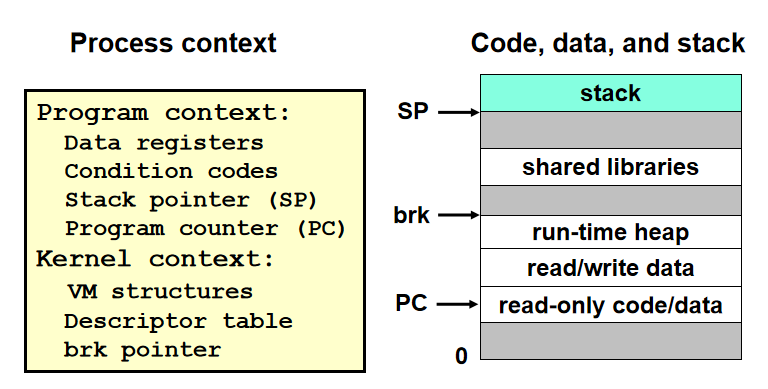

# Concurrent Programming

[TOC]


### 一、理论

#### 0. Motivation

并行的好处：

1. 处理异步事件。不知道什么时候回来，如handler
2. 支持多CPU的使用，利用更多的资源。
3. 解决异步设备（I/O设备）读写慢的情况
4. 和用户打交道。输入较慢，不干等
5. 网络如果串行，不能解决多人的情况。OS定时轮询不同的程序，进行分配（进程调度，不希望慢的操作把快的操作挡住了）

并发编程：OS提供一个调度接口，帮我们实现调度。

#### 1. 应用层实现并发的方法

##### 1.1 Process

创建多个进程，实现一个并行的server：有client连接时，就分配一个子进程，丢给子进程去处理。

多进程的方式，只受到操作系统进程数和资源的限制。


* fork后，父子的listenfd，connfd指向同一处
* 先关掉子进程的listenfd：子进程已连接，不再需要
* 关掉父进程connfd：connfd对父进程没有用，父进程不再管该client
* long-running进程的资源要及时回收：连接符fork后有两份，不要用的那份如果不及时回收，之后将永远不会释放已连接描述符的文件表条目entry。
* 用SIG_CHLD回收子进程

共享信息：

* 通过共享file table(显式)
* 不共享地址空间，进程有独立的地址空间

缺点:

* 不轻量（大多数都是短连接）
  * 每个client都要创建一个进程，额外代价大。
  * 进程越多，调度队列长，回收难
* 父子进程共享数据困难。需要IPC（interprocess communication），如FIFO队列，或两个进程映射到同一块共享内存。


##### 1.2 Thread

线程：一个进程里和执行流相关的部分。我们希望线程内独立的部分越小，这样overhead更小。

进程 = process context + code, data, stack



* 一个Context代表了运行的一个程序
* vm structure（OS配的，记录进程相关的内存信息
* brk pointer（堆指针）

Process= **thread** + code, data, and kernel context


* 栈是代表了线程执行的整个不同的过程，所以有自己的stack
* main thread：每个进程至少包括的一个线程（进程开始时）
* 每个线程有自己逻辑的执行流，维护自己的名字（thread id，TID）

线程vs进程：

* 线程也有context switch，但是上下文比进程小得多，切换更快
* 线程没有父子层次，只有对等线程池，读写相同共享数据（进程一般不共享）。可杀死任何对等线程。


Posix标准接口

```c
#include <pthread.h>
typedef void *(func)(void *);

/*
* 成功返回0，出错非0
* 创建并设置tid为线程号，attr配置信息，func为执行的函数，arg为函数参数
*/
int pthread_create(pthread_t *tid, pthread_attr_t *attr, func *f, void *arg);

/* 返回自己的线程号*/
pthread_t pthread_self(void);

/* 
* 不返回
* 如果主线程调用：等待所有对等线程终止后终止，并终止整个进程
*/
void pthread_exit(void *thread_return);

/*
* 成功返回0，出错非0
* 阻塞，等待线程tid终止，回收其内存。必须指定tid
*/
int pthread_join(pthread_tid tid, void **thread_return);

/*
* 成功返回0，出错非0
* 分离线程，不能被其他线程回收、杀死，系统释放内存
*/
int pthread_detach(pthread_t tid);
```

* 线程退出，不要轻易使用exit函数：导致所有的线程全部结束
* 如果没有join，可能main thread先结束，peer thread后结束
* web服务器中，每个线程不需要等待别人终止，一般分离自身。防止main先结束。


```c
/* thread routine */
void *thread(void *vargp)
{
    int connfd = *((int *)vargp); //进行一个cast得到connfd

    Pthread_detach(pthread_self()); //自我分离
    Free(vargp); //所有线程共享一块资源，主进程malloc，可通过子进程free
    echo(connfd);
    Close(connfd); //共享的fd，谁close都一样
    return NULL;
}
int main(int argc, char **argv){
    int listenfd, *connfdp
    socklen_t clientlen;
    struct sockaddr_in clientaddr;
    pthread_t tid;

    if (argc != 2) {
        fprintf(stderr, "usage: %s <port>\n", argv[0]);
        exit(0);
    }
    listenfd = open_listenfd(argv[1]);
    while (1) {
        clientlen = sizeof(clientaddr);
        connfdp = Malloc(sizeof(int));
        *connfdp = Accept(listenfd,(SA *)&clientaddr, &clientlen);
        Pthread_create(&tid, NULL, thread, connfdp);
    }
}

```


缺点：

* 共享资源。如果直接传递connfd没有malloc，该对象可以被多个thread访问。创建出线程以后，main中再次Accept会覆盖掉局部变量connfd。其他线程会突然发现自己的fd变了。所以每次要malloc


##### 1.3 I/O多路复用

I/O多路复用，是有限状态机的思路。在一个线程内部去调度。

**select**（syscall）：

* 监听多个fd（包括listenfd和connfd），当有fd有消息来了的时候，它会从select中退出
* 在一个bitmap中，每一个bit代表一个fd，置1代表要监听

```c
#include <sys/select.h>

/* 
* 返回已经准备好的fd的个数，出错-1
* Maxfd：监听最大数
* Readset：传过去时写好哪些fd被监听，返回哪些有消息
*/
int select (int maxfd, fd_set *readset, NULL, NULL, NULL);

/* clear all bits in fdset. */
void FD_ZERO(fd_set *fdset);
/* clear bit fd in fdset */
void FD_CLR(int fd, fd_set *fdset);
/* turn on bit fd in fdset */
void FD_SET(int fd, fd_set *fdset);
/* Is bit fd in fdset on? */
int FD_ISSET(int fd, *fdset);
```

例子：

```c
    FD_ZERO(&read_set);
    FD_SET(STDIN_FILENO, &read_set);
    FD_SET(listenfd, &read_set);
    while(1) {
        ready_set = read_set;
        Select(listenfd+1, &ready_set, NULL, NULL, NULL); // 可以同时监听多个
        if (FD_ISSET(STDIN_FILENO, &ready_set)
            /*read command line from stdin */
            command();	
        if (FD_ISSET(listenfd, &ready_set)){
            connfd = Accept(listenfd, (SA *)&clientaddr, &clientlen); // 因为有消息了，所以肯定立刻返回
            echo(connfd);
        }
    }
```

实现server：

* 监听所有的listenfd，connfd
* 如果listenfd有消息，拿到新的connfd，加入监听队列
* 如果connfd有消息，服务（并close connfd，remove）
* 需要一个结构体记录状态


缺点：

* 没有利用多核

##### 1.4 总结

开了一家餐馆，想要扩大经营：

* 进程：再开一家店，都有一套完整的东西，开销大，流动麻烦
* 线程：多放几套桌子和服务员
* I/O：雇一个能力强的服务员，不会被阻塞，跑得快。事件驱动，有事就叫服务员，服务员监听事件（select）。（原来是线程切换，现在是服务员技能切换）


#### 2. 共享变量

#### 3. 同步问题

