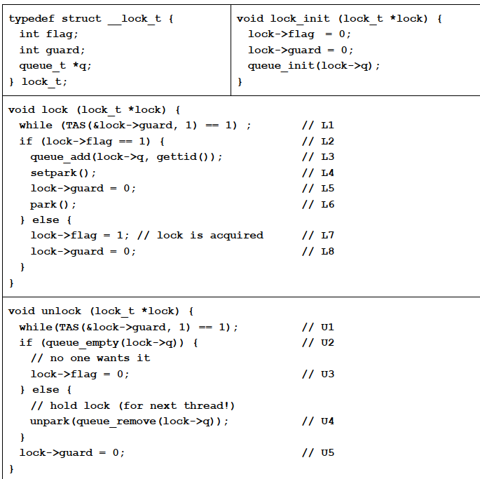

# Lock

[TOC]

### 一、概念

#### 0. 理解

锁是一个变量，保存一个状态（unlocked，locked）

pthread locks（POSIX库提供）

```cpp
pthread_mutex_lock(&lock);
balance = balance + 1;
pthread_mutex_unlock(&lock);
```

衡量锁

* Mutual exclusion正确性
* Fairness公平
* Performance性能

#### 1. Controlling Interrupts

并非是并发状态下的锁

在临界区关闭中断（保证临界区代码不被打断）

```cpp
void lock() {
    DisableInterrupts();
}
void unlock() {
    EnableInterrupts();
}
```

缺点：

* 允许所有调用线程执行特权操作（打开关闭中断） 

  一个贪婪的程序可能开始时就调用 lock()，独占处理器；恶意程序调用 lock()后，死循环，系统无法重新获得控制，只能重启。 

* 不支持多处理器。在不同的 CPU 上，每个线程关闭各自的中断也没有作用。 

* 关闭中断导致中断丢失，可能会导致严重的系统问题。

  如磁盘设备完成了读取请求，但 CPU 错失了这一事实

* 效率低

#### 2. Spin Lock：三种实现

##### 2.1 Test and Set

```cpp
typedef struct __lock_t { int flag; } lock_t;

void init (lock_t *mutex) {
   mutex->flag = 0; // 0 -> available, l -> held
}

void lock (lock_t *mutex) {
   while (mutex->flag == 1) ; // spin-wait (waste)如果还未set就switch，那么另一个thread也能获得锁
   mutex->flag = 1; // now SET it!
} 

void unlock(lock_t *mutex) { mutex->flag = 0; }
```

* correctness：Test和set不可分割
* performance：这里没拿着锁的人一直在检查，占着CPU，有锁的人用不到CPU去放锁，只能靠time slice切换

**硬件实现**

```cpp
// 硬件保证原子性完成
int TestAndSet(int *old_ptr, int new) {
   int old = *old_ptr;  // fetch old value at old_ptr
   *old-ptr = new;      // store ‘new’ into old_ptr
   return old;          // return the old value
}

// 修改代码：
void lock (lock_t *lock) {
   while (TestAndSet(&lock->flag, 1) == 1)
      ; // spin-wait (do nothing)
} 
```

**软件实现**

前提：**预先知道有N个thread**

只能多个thread在一个CPU上

* 检查是否有并发？
  * 如果有：大家一起重来
  * 如果没有：执行操作

```cpp
int flag[N] ;//one flag per thread
int TestAndSet(lock_t Lock) {	/
    int ret ;
    while (1) {		   	
        flag[me] = 1 ;	   	// 表明自己开始操作
        if (AnyoneElseInterested(me))//检查是否有并发，flag数组每个查一遍
            flag[me] = 0 ;   	//yes, reset my warning, try again
        else {
            ret = Lock.flag ;	//set ret to value of Lock
            Lock.flag = 1 ;	// 上锁
            flag[me] = 0 ;
            return ret ;
        }
    }
}
```

**评价** 

* correctness：
  * 保证一次只有一个进入临界区
* fairness：
  * unfair：可能会starvation，没有公平机制
* performance：
  * 在单核上，开销大。这里没拿着锁的人一直在检查，占着CPU，要等这些人spin完，靠time slice切换
  * 多核上：thread大致等于CPU，性能不错

##### 2.2 Compare-And-Swap

硬件实现，逻辑如下

```cpp
int CompareAndSwap(int *ptr, int expected, int new) {
    int actual = *ptr;
    if (actual == expected) //有一个compare，不会像TestAndSet一直写
    	*ptr = new;	
    return actual;
}
void lock(lock_t *lock) {
    while (CompareAndSwap(&lock->flag, 0, 1) == 1)
    	; // spin
}
```

##### 2.3 LoadLinked and StoreConditional

硬件实现，逻辑如下

```cpp
int LoadLinked(int *ptr) {
	return *ptr;
}

int StoreConditional(int *ptr, int value) {
    if (no one has updated *ptr since the LoadLinked to this address) { // 先read，sotre的时候检查是否被改过
    	*ptr = value;
    	return 1; // success!
    } else 
    	return 0; // failed to update
}


//使用
void lock(lock_t *lock) {
	while (1) {
		while (LoadLinked(&lock->flag) == 1)
			; // spin until it’s zero
		if (StoreConditional(&lock->flag, 1) == 1)
			return; // if set-it-to-1 was a success: all done
		// otherwise: try it all over again
	}
}

void unlock(lock_t *lock) {
	lock->flag = 0;
}
```

性能类似Compare-and-swap

##### 评价

* 正确的
* unfair
* poor performance：一直在spin
* thread少的时候，代码简单，效率高。在内核多用

#### 3. Ticket Lock

先到先得，取号模式。让spin lock排队

##### 3.1 Fetch-and-Add

```cpp
int FetchAndAdd(int *ptr) { //原子指令，防止两个人号相同
   int old = *ptr;  // fetch old value at ptr
   *ptr = old + 1;  // 加1
   return old;      // return the old value
}

void init (lock_t *lock) {
   lock->ticket = 0;
   lock->turn   = 0;
}

void lock (lock_t *lock) {
   int myturn = FetchAndAdd(&lock->ticket);
   while (lock->turn != myturn) //排队等叫号
      ; // spin
} 

void unlock(lock_t *lock) { 
    lock->turn = lock->turn + 1;
}
```

存储空间大，用的不再是bit，是int

##### 避免spin：yield

主动放弃CPU：`yield()`，放锁+通知（唤醒）。

overhead：yield带来的频繁的context switch。没办法准确、一次性扔个要锁的人

```cpp
void lock () {
   while (TestAndSet(&flag, 1) == 1) 
      yield(); // BUG:yield可能被打断；没有人唤醒它。多个线程执行顺序随机，也可能饿死
} 
```

##### Queue (park)

两种调用：

* park()：休眠
* unpark(tid)：唤醒某个线程

```cpp
void lock (lock_t *lock) {
   while (TestAndSet(&lock->guard, 1) == 1) 
      ; // acquire guard lock by spinning
   if (lock->flag == 0) {
      lock->flag = 1; // 上锁
      lock->guard = 0; // 解除小锁
   } else {
      queue_add(lock->q, gettid()); // 当前thread入列
      lock->guard = 0; // 解除小锁
      park(); //休眠
   }
} 
void unlock (lock_t *lock) {
   while (TestAndSet(&lock->guard, 1) == 1) 
      ; // acquire guard lock by spinning
   if (queue_empty(lock->q)) {
      // queue为空
      lock->flag = 0; 
   } else 
      // 给下一位，不用reset flag，因为手递手交给了下一位
      unpark(queue_remove(lock->q)); //踢出并唤醒，传递lock
   lock->guard = 0; // 解除小锁
} 
```

* guard起到spin lock作用，保护lock指令（保护flag）。内部锁（像锁保护门，门保护房间）

* 问题deadlock
  * 如果在park之前switch：
    * thread A执行完line 9的解除guard
    * context switch到thread B
    * B放锁，正好传给A，unpark唤醒A
    * A先收到了unpark信号，然后park（闹钟响了之后，睡着的）
  * 但是把line 9，10换一下更不对：还没开锁就睡觉去了，把其他人都锁死了
  * 解决：

```cpp
queue_add(lock->q, gettid());
setpark(); // 做标记，硬件实现：检查在释放guard和park之间有无唤醒
lock->guard = 0;
park();
```

#### 4. futex

基于队列的复杂，开销大

Linux下高效实现：futex

* 每个futex关联了一个物理内存地址address
* 事先建好一个内核队列
* futex_wait(address,expected)：检查地址中的值，一致则睡眠，否则返回
* futex_wake(address)：唤醒地址中的线程

```cpp
void mutex_lock (int *mutex) { 
   int v;
   if (atomic_bit_test_set(mutex, 31) == 0) return; // 第31位标记lock，其他位为counter
   atomic_increment (mutex);  // add counter等待人数
   while (1) { 
      if (atomic_bit_test_set(mutex, 31) == 0) { //check
         atomic_decrement(mutex);
         return;
      }
      v = *mutex; 
      if (v >= 0) continue; // 检查锁的状态，int的最高位，可用正负来检查
      futex_wait(mutex, v); //当mutex中的值变化时，会醒来，醒来了还是要自己抢的
    } 
}

void mutex_unlock (int *mutex) {
    // 最高位flag设为0，同时检查是否为0（counter=0？），是否有人要锁
   if (atomic_add_zero(mutex, 0x80000000)) 
      return;
    
    // 如果在这之间锁被拿走了，可能叫错了，没关系，他会继续睡的
    
   futex_wake(mutex); // 只负责叫醒，没有传递锁
}
```

**2-phase lock** (hybrid)

1. lock spin ：line 6-9
2. caller put to sleep：line 12

#### 5. 总结

要保护的区域

* 比较短：spin lock
* 比较长：yield，短时间内等不到

### 二、题目

#### 1. CAS & 读写锁

Sam wants to implement a spinlock with compare-and-swap(CAS)  instructions.

* CAS and  AtomicAdd perform the same function as the code below shows, but in an atomic manner.

```cpp
/* atomic instructions */
int CAS(int *p, int exp, int new) {
    int actual = *p; 
    if (actual == exp) *p = new; 
    	return actual; 
}
void AtomicAdd(int *p, int value) {
    *p = *p + value;
}

/* spinlock with CAS */
typedef struct __lock_t { int flag; } lock_t; // init to 0 
void lock(lock_t *lock) { 
    while(CAS(&lock->flag, [1], [2]) == 1); //spin 
}
void unlock(lock_t *lock) {
    lock->flag = 0; 
}
```

1. Fill the blanks in lock. (2*2'=4')

   **[1]：0**

   **[2]：1**

2. Does this lock gaurantee fairness? Explain your answer through an example. (3') 

   **No. It is possible for a thread to enter while loop early but get lock late.** 

Sam then extends the simple spinlock above to a **read-write lock** (rwlock). Readers, holding the read locks, should only perform read-only operations. The writer, holding the write lock, can read and modify the object. The rwlock guarantees the following two principles:

* **Principle 1**: The read lock can be acquired by multiples reader threads, i.e., multiple readers can run concurrently.
* **Principle 2**: The write lock must be held exclusively, i.e., a writer can NOT run concurrently with other writers and readers. 

The code for **rwlock** is shown below. Read the code and answer the questions.
**Hint**: 0x80000000 is the 4-byte int with the most significant bit set to 1. 

```cpp
// lock->flag init to 0
void write_lock(lock_t *lock) {
	while(CAS(&lock->flag, 0, 0x80000000) != 0);
}
void read_lock(lock_t *lock) {
    int tmp;
    while(true) {
        tmp = lock->flag;
        if (tmp >= 0 && CAS(&lock->flag, tmp, tmp+1) == tmp)
        return;
    }
} 
void write_unlock(lock_t *lock) {
    ________[3]__________
}
void read_unlock(lock_t *lock) {
	AtomicAdd(&lock->flag, _[4]_);
}
```

3. What is the value of lock->flag under each of the following cases? (2*1'=2')
  a) A single writer holds the lock.    **0x80000000** 
  b) Five readers hold the lock simultaneously.  **0x5**

4. Fill the blanks in write_unlock and read_unlock. (2'*2=4')

   **[3] lock->flag = 0;**

   **[4] -1** 

5. The code above implements a reader-friendly rwlock (i.e., the lock perfers readers to writers). Please explain the reason. (Hint: consider the fairness for writers) (3’)

  **Since a writer must wait until all readers their critical section, if new readers lock continuously before the old readers unlock, the writer will starve.** 

6. How can you modify the implementation to make it a writer-friendly rwlock? Show your code and explain the reason.(3’) 

  **Let writer turn the most significant bit to 1 if the previous writer unlock and wait for current readers to unlock like before instead of waiting for all readers to unlock.** 

  ```cpp
  // we only need to change write_lock
  void write_lock(lock_t *lock) {
      int tmp;
      while(true) {
          tmp = lock->flag;
          // try to grab write lock
          if (tmp >= 0 && CAS(&lock->flag, tmp, tmp | 0x80000000) == tmp ) {
              While (lock->flag & 0x7fffffff > 0)
                  ;   // wait until current readers quit
              return;
      	}
      }
  }
  ```

  

#### 2. ticket lock

1. Sam modifies the ticket lock by adding one line **“IDLE(...); ”** in the while-loop.

* IDLE(n) will consume **C*n** CPU cycles where C is a user-defined **constant**.

```cpp
/* The original ticket lock */
void lock(lock_t *lock) { 
    int myturn = FetchAndAdd(&lock->ticket); 
    while (lock->turn != myturn) ; 
}
/* A modified ticket lock */
void lock(lock_t *lock) { 
    int myturn = FetchAndAdd(&lock->ticket); 
    while (lock->turn != myturn) 
        IDLE(myturn - lock->turn);
}
```

1) What’s the advantage after adding the “IDLE(...);” line? (2')

> In the modified ticket lock, a lock waiter will idle (**instead of always spinning** in the original ticket lock) some amount of time proportional to his distance between the lock holder based on the fact that late-comers will wait more time before the lock is passed to them. This can greatly reduce the number of memory access from the lock waiters. 
>
> 修改后，等待的线程会idle一段时间（而不是一直spin 浪费cpu），时间与在queue种排队距离成比例。大大减少了check的次数，减少对内存访问。

2) What’s the disadvantage after adding the “IDLE(...);” line? (2')
HINT: Consider what if an inappropriate constant C is chosen. 

> However, it is hard to estimate an appropriate idle time since the time of critical section is unknown and variant. It may slow the whole queue if one of the waiter’s idle time is too long. 
>
> 如果idle时间太长，轮到它的时候他在休眠，那会浪费时间

3) For setting IDLE time, why to use “myturn-lock->turn” rather than a fixed value? (2') 

> In ticket lock, the time a thread will wait on the lock is proportional to his distance between the lock holder. So IDLE(myturn - lock->turn) saves memory access with respect to his waiting time. 
>
> 等待时间与他与持锁者距离成正比

#### 3. Test-and-Set

TAs find using normal test-and-set (TAS) is not a good approach, because TAS instruction is quite expensive (as compared to a normal load from memory). Thus, they instead use this code to implement a lock, so-called “double-test-and-set”.

```cpp
typedef struct __lock_t { int flag; } lock_t; // init to 0
void lock(lock_t *lock) {
    do {
        while (lock->flag) // unprotected lock check
        ; // spin
    } while (TAS(&lock->flag, 1)); // actual atomic locking
}
void unlock(lock_t *lock) { lock->flag = 0; }
```

1. Does this lock work correctly? Why or why not? (3’)
2. When does it perform better than a simple spinlock built with test-and-set? Why?
Hints: Consider the number of threads acquiring the same lock. (3’) 

**ANS:**

1. It works correctly. Assume one thread call lock(), if the lock is acquired by another thread, lock() will spin. Otherwise, the TAS still keeps that there is only one thread can acquire the lock.
2. When there are many threads acquiring the same lock (i.e., the
  contention is high), the performance is better. 
  TAS is only used to try to get the lock when it is likely to be free. Thus the expensive atomic memory operations happen less often.  

#### 4. queue,park

To avoid spin, we use park() and unpark() to refine the implementation of lock.
(NOTE: the following C code is identical to the C code shown in class)




1. 执行顺序“t”，再调用T，执行：**L2** 【初始时两把锁都没人拿】

2. 执行顺序“ttt”，再调用T，执行：**L8** 【T上锁】

3. 执行顺序“tttsss”，再调用S，执行：**L1** 【T没放开guard】

4. 执行顺序“tttssstttsss”，再调用S，执行：**L4** 【S进队列等】

5. S is waiting on the lock. Which line of code in lock() makes S wait for the lock?  **L6** 【park】

   Meanwhile, T has completed its critical section and starts to call unlock() to release the lock. Then, the CPU scheduler runs **“tt”**. Which line of code in unlock() will be executed by **T** when it is scheduled again? **U4** 【T去放锁】

2. If the line L4 in lock() is deleted, the modified code exists a race-condition bug. Please explain how does it happen? (3’)

  **Before one thread calls park(), another thread calls unpark(), then the first thread sleeps forever.** 

3. Please list at least two purposes of the lock->guard variable? (3’) 

   **Eliminate the race when several threads acquire the same lock (i.e., race on flag). Eliminate the race on queue.** 

