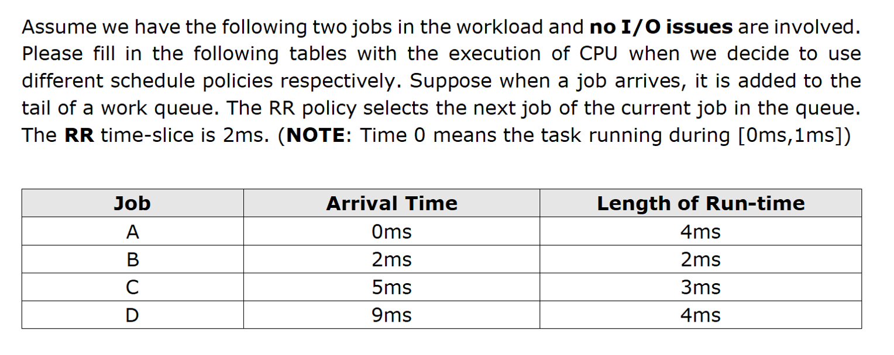
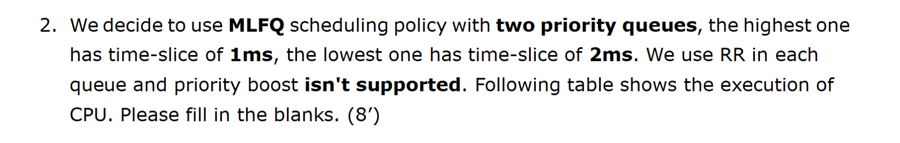
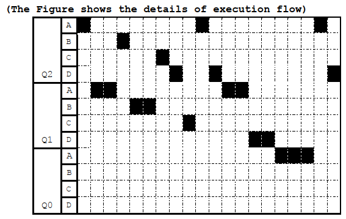

# Process scheduling

[TOC]

#### 一、概念

##### 1. Motivation

* 机制Mechanisms：底层实现方式/协议

  content switch，paging，lock，用queue实现FIFO，time-slice多长，MMU for 虚拟内存管理

* 策略policy：何时调用机制，做出决定

  cache中LRU replacement，FIFO，schedule decisions

策略机制独立。

WorkLoad假设：

1.  每个任务运行相同的时间。

2. 每个任务在相同的时间到达。

3. 调度一个任务之后，会一直占用CPU。
4. 所有的人都使用CPU，不考虑IO：不让出CPU等待IO
5. 每个任务的运行时间已知：我们像先知一样把所有事情都放到最理想的情况下。

度量：

* Turn around time：**完成**job时刻 - job**到达**时刻。性能指标。
* response time：job**开始执行**时刻 - job**到达**时刻。交互性指标。

##### 2. FIFO：First In, First Out

> 也叫FCFS：First come，first served

特点：

1. 每个job执行不会被打断
2. 先来先执行：排队执行

缺点：

若执行时间不同，对于turnaround度量来说，更希望先去调度任务短的。

##### 3. SJF: Shortest Job First

特点：（放宽假设1）

* 最短任务先执行：比较的是原始执行时间（非剩余时长）
* non-preemptive 非抢占式：job中途不打断
* preemptive 抢占式：job中途打断，但是此时大job可能剩余不多（但比较的是原始时长）

缺点：

如果不同时到达，且不能抢占的话：考虑大job先到达的场景

##### 4. STCF：Shortest Time-to-Completion First

特点：（放宽假设1，2，3）

* 最短任务先执行：这里比较的是执行剩余时长。
* **preemptive** 抢占式： 新job到达，发生重新调度。允许小任务打断大任务。

缺点：

fairness

##### 5. RR：Round Rabin

轮询：引入时间片的机制，不但要抢占，也最好不要让一个job一直占用CPU。增加了turnaround time，但是大大减少了response time。是一种权衡。

> 实际情况下，round rabin在每一次切换的时候会引入额外的上下文切换的开销，总的时间会更久一点。要flush TLB entry的缓存，被换进来的任务肯定是比连续跑的TLB慢一点，包括流水线也得全部刷掉。所以不可能把时间片无限缩小，这会加大时间片切换的额外开销。

特点：（可放宽假设4）

运行满一个time slice就切换。可认为每个时间片是单独的子任务。

I/O和CPU的协作：可能需要两个来维护running和suspend状态的队列。

##### 6. MLFQ：Multi-Level Feedback Queue

最后放宽假设5，在无法预知任务时长下，优化turn around time和response time。

核心想法：从历史中进行学习（feedback），在执行时调整，来预测未来的情况。（凡是带有预测的，基本上都是这种learning from history策略。）

特点：

1. 有多个running队列。不同的priority。一个队列中的策列可以是随机或RR。
2. 带有feedback来调整策略：如运行满一个time slice未完成就降低priority，新来的priority高，任务会在不同队列移动。
3. 把任务变成很多阶段，认为一个阶段内的行为是有连续性的，行为是可以通过一个阶段内之前的行为来预测的。
4. friendly to short jobs 

缺点：

1. 饥饿问题。没有上升的机制，底层long-running任务可能一次都没有机会得到执行。
2.  一些小技巧可以骗取更多的CPU，比如一个long-running任务，在时间片结束之前主动调用yield（主动放弃CPU不降级），这个任务就可以和交互式任务来抢CPU。
3. 程序可能会改变行为。开始是交互式的，然后变成long-running，再变成交互式的，但没有上升的策略。

解决方法（下方规则4、5）

改变priority规则：

1. 新job最高优先级
2. 用完整个time slice后降级
3. time slice内主动释放CPU，priority不变。
4. 周期性的boost：一段时间S后，将所有工作放到最高优先级。
5. （修改2、3）比较早放弃CPU的job才认为是交互式的，否则就踢到下面去（存在一个阈值）。

#### 二、习题

##### 1. preemptive

题目说明：

* 新job放在队尾
* RR选择是按队列顺序
* 没有说明non-preemptive，说明要考虑抢占

1. FIFO

| 0    | 1    | 2    | 3    | 4    | 5    | 6    | 7    | 8    | 9    | 10   | 11   | 12   |
| ---- | ---- | ---- | ---- | ---- | ---- | ---- | ---- | ---- | ---- | ---- | ---- | ---- |
| A    | A    | A    | A    | B    | B    | C    | C    | C    | D    | D    | D    | D    |
| A到  |      | B到  |      |      | C到  |      |      |      | D到  |      |      |      |

turnaround= $\frac{(4-0)+(6-2)+(9-5)+(13-9)}{4} =4 $

response = $\frac{(4-2)+(6-5)+(9-9)}{4} = 0.75$

2. SJF(抢占)

| 0    | 1    | 2     | 3    | 4    | 5     | 6    | 7    | 8    | 9    | 10   | 11   | 12   |
| ---- | ---- | ----- | ---- | ---- | ----- | ---- | ---- | ---- | ---- | ---- | ---- | ---- |
| A    | A    | **B** | B    | A    | **C** | C    | C    | A    | D    | D    | D    | D    |
| A到  |      | B到   |      |      | C到   |      |      |      | D到  |      |      |      |

turnaround= $\frac{(9-0)+(4-2)+(8-5)+(13-9)}{4} =4.5 $

response = $ 0$

3. STCF

| 0    | 1    | 2    | 3    | 4    | 5    | 6    | 7    | 8    | 9    | 10   | 11   | 12   |
| ---- | ---- | ---- | ---- | ---- | ---- | ---- | ---- | ---- | ---- | ---- | ---- | ---- |
| A    | A    | A    | A    | B    | B    | C    | C    | C    | D    | D    | D    | D    |
| A到  |      | B到  |      |      | C到  |      |      |      | D到  |      |      |      |

* STCF本身自带抢占机制

turnaround= $\frac{(4-0)+(6-2)+(9-5)+(13-9)}{4} =4 $

response = $\frac{(4-2)+(6-5)+(9-9)}{4} = 0.75$

4. RR（time slice = 2）

| 时间 | 0    | 1    | 2    | 3    | 4    | 5    | 6    | 7    | 8    | 9    | 10   | 11   | 12   |
| ---- | ---- | ---- | ---- | ---- | ---- | ---- | ---- | ---- | ---- | ---- | ---- | ---- | ---- |
| 执行 | A    | A    | B    | B    | A    | A    | C    | C    | C    | D    | D    | D    | D    |
| 到达 | A到  |      | B到  |      |      | C到  |      |      |      | D到  |      |      |      |
| 队列 | A    | A    | BA   | BA   | A    | AC   | C    | C    | C    |      |      |      |      |

**B先加到队尾，然后刚刚执行完的A才放到队尾。**

turnaround= $\frac{(6-0)+(4-2)+(9-5)+(13-9)}{4} =4 $

response = $\frac{6-5}{4} = 0.25$

5. MLFQ（higher timeslice=1，lower timeslice=2）

| 时间  | 0    | 1    | 2     | 3    | 4    | 5    | 6    | 7    | 8    | 9    | 10   | 11   | 12   |
| ----- | ---- | ---- | ----- | ---- | ---- | ---- | ---- | ---- | ---- | ---- | ---- | ---- | ---- |
| 执行  | A    | A    | **B** | A    | B    | C    | A    | C    | C    | D    | D    | D    | D    |
| 到达  | A到  |      | B到   |      |      | C到  |      |      |      | D到  |      |      |      |
| 队列1 | A    |      | B     |      |      | C    |      |      |      |      |      |      |      |
| 队列2 |      | A    | A     | AB   | BA   | A    | AC   | C    |      |      |      |      |      |

* t=2时被抢占，并且t=3和t=4从A换到B是因为A在被抢占之前已经执行了1ms，可以看作t=1~3中A的2ms timeslice中间被暂停了1ms(如果非抢占不暂停)
* t=5时B运行结束，虽然没用完timeslice但是不会给A

turnaround= $\frac{(7-0)+(5-2)+(9-5)+(13-9)}{4} =4.5 $

response = $\frac{0}{4} = 0$

##### 2. RR

The following table shows the information of four jobs. No I/O issues are involved.

| Job  | Arrival Time | Length of run-time |
| ---- | ------------ | ------------------ |
| A    | 0ms          | 9ms                |
| B    | 2ms          | 6ms                |
| C    | 6ms          | 5ms                |
| D    | 8ms          | 1ms                |

* The RR time-slice is 1ms
* Suppose when a job arrives, it is added to the tail of a work queue. The RR policy selects the next job of the current job in the queue.

| 时间 | 0    | 1    | 2    | 3    | 4    | 5    | 6    | 7    | 8    | 9    | 10   | 11   | 12   |
| ---- | ---- | ---- | ---- | ---- | ---- | ---- | ---- | ---- | ---- | ---- | ---- | ---- | ---- |
| 执行 | A    | A    | B    | A    | B    | A    | B    | C    | A    | B    | D    | C    | A    |
| 到达 | A到  |      | B到  |      |      |      | C到  |      | D到  |      |      |      |      |
| 队列 | A    | A    | BA   | AB   | BA   | AB   | BCA  | CAB  | ABDC | BDCA | DCAB | CAB  | ABC  |

| 时间 | 13   | 14   | 15   | 16   | 17   | 18   | 19   | 20   | 21   |
| ---- | ---- | ---- | ---- | ---- | ---- | ---- | ---- | ---- | ---- |
| 执行 | B    | C    | A    | B    | C    | A    | C    | A    |      |
| 到达 |      |      |      |      |      |      |      |      |      |
| 队列 | BCA  | CAB  | ABC  | BCA  | CA   | AC   | CA   | A    |      |

**先将新到的加入队尾，再将执行完的放到队尾**

turnaround= $\frac{(21-0)+(17-2)+(20-6)+(11-8)}{4} =13.25 $

response = $\frac{(0-0)+(2-2)+(7-6)+(10-8)}{4} = 0.75$

##### 3. MLQF（boost）

Suppose we use **MLFQ** scheduling policy. (8’)

* There are 3 priority queues Q0, Q1, and Q2; Q2 has the **highest** priority, and Q0 has the **lowest** priority. 
* **FIFO** is used in each queue. 
* The CPU scheduling is carried out only at completion of processes or time-slices.
* The following table shows the **arrival time** of jobs in the workload.

| Job  | Arrival Time |
| ---- | ------------ |
| A    | 0ms          |
| B    | 7ms          |
| C    | 15ms         |
| D    | 19ms         |

Following table shows the execution of CPU. No I/O issues are involved.
NOTE: X represents an unknown time quantum 

| Time | 0    | X    | 3X   | 4X   | 6X   | 7X   | 8X   | 9X   | 10X  | 11X  | 13X  | 15X  | 19X  |
| ---- | ---- | ---- | ---- | ---- | ---- | ---- | ---- | ---- | ---- | ---- | ---- | ---- | ---- |
| CPU  | A    | A    | B    | B    | C    | D    | C    | A    | D    | A    | D    | A    | D    |

1) Please determine the following values. (All the answers are integers) (10’)

**X:** [1] ms
Time-slices: **Q2** = [2] ms, **Q1** = [3] ms, **Q0** = [4] ms
**Time between two priority boosting**: [5] ms

**X:** 3 ms
Time-slices: **Q2** = 3 ms, **Q1** = 6 ms, **Q0** = 9 ms
**Time between two priority boosting**: 27 ms

2) Based on the above execution, can you list an unwise parameter of this **MLFQ** scheduling policy, and explain why? (3’)

**The time between two priority boosting is too short. Jobs can hardly run in Q0.** 

