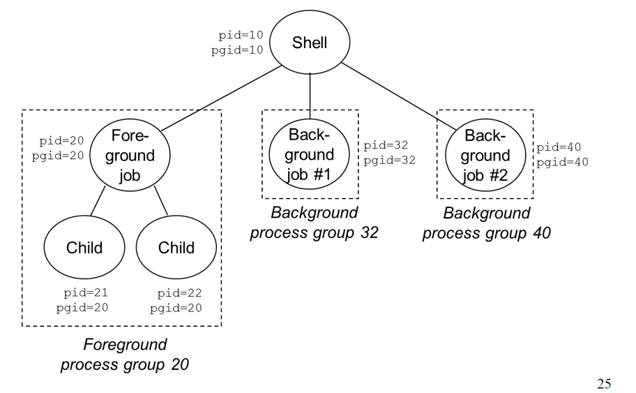
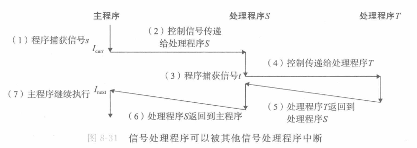

# Signal

[TOC]

### 一、概念

#### 1. 理解

Signal：一个消息、一个数字（不是操作），只是发了一个信号

改变执行流：一个进程想打断另一个进程或者给另一个进程发消息，会通过**kernel**以signal的形式去做。  

触发：

* 硬件发送
* 软件发送：Alarm机制。（可能有权限等问题）

异步操作：发送signal给一个进程，这个进程不一定会运行。每个signal维护了一个bitmap，发送了只是置为了1，需要接收的进程去主动检查。

重要的**数据结构bit vector**：

* signal mask（block）：阻塞信号k，kernel将第k位bit置1
* signal pending：收到信号k，kernel将第k位bit置1（收到一次/多次，是一样的效果）

#### 2. 进程组

signal是以**进程组**(Process Groups)为对象发送的，可以发给一个组或者组里的特定的一个进程。

```c
#include <unistd.h>

/* 返回当前进程组ID */
pid_t getprgrp(void);

/* 将进程pid的组号设为pgid
* pid = 0：当前进程
* pgid = 0：组号为当前进程号
* 当前进程15151调用setpgid(0,0)：创造了一个进程组号为15151的组，并将15151加入该组。
*/
int setpgid(pid_t pid, pid_t pgid);
```


#### 3.Sending signal

1. /bin/kill

   ```shell
   /bin/kill -9 -15151 
   ```

   发送信号9（SIGKILL）给组号为15151的每个进程

2. 键盘发送

    job（抽象）：执行一条命令行创建的进程。前台至多一个job（一个进程组）

   pipe：进程之间通讯方式，一种`syscall`

   

   按下`ctrl+c` ，硬件发送SIGINT给shell，shell转发信号，对前台进程组每个进程发相同的消息。

   `ctrl+z` 发送SIGTSTP，（暂停）挂起进程。

3. kill函数

   ```c
   #include <sys/types.h>
   #include <signal.h>
   
   /* 发送信号sig给进程pid
   * pid<0：发送给进程组|pid|中每个进程
   * pid=0:当前进程组，包括自己
   * 成功返回0，失败-1
   */
   int kill(pid_t pid, int sig);
   ```

   `Pause（）` ：停在那里，等待一个消息来。

4. alarm函数

   通过alarm让kernel在secs秒后给自己发送SIGALARM。收到后的反应，依据自己设置的信号槽函数（signal handler）。

   整个系统里面只有一个alarm，新设的闹钟会覆盖之前还没响的闹钟。（如果secs=0，不新设）

   ```c
   #include <unistd.h>
   
   /* 返回前一个闹钟剩余秒数，无则为0*/
   unsigned int alarm(unsigned int secs);
   ```

#### 4. Receive signal

* pending signal：收到但是还没有处理。

  一种类型只能pending一个信号，之后来的被简单丢弃。（将pending向量对应位置置1，之后再来也只是置1）

* blocking signal：message不会消失，只是不执行。

  block也是一个bitmap向量，可以关闭一部分signal接受。恢复时会处理积压的signal。

接受到信号，检验是否有未阻塞待处理的信号(pending & ~blocked)，内核强制进程接受一个（一般是序号最小的）。



Signal handler在执行过程中也可能会context switch。

#### 5. 注册Signal handler

通过syscall signal去注册handler。

handler函数运行在user mode

**不能覆盖sigstop和sigkill。**signal(SIGKILL, handler)返回SIG_ERR

```c
#include <signal.h>
typedef void (*sighandler_t)(int)
    
/* 对序号为signum的信号，编写一个操作handler（可以是自定义函数）
* 返回之前操作程序的指针，错误返回SIG_ERR(不设置errno)
*/
sighandler_t signal(int signum, sighandler_t handler);
```

**信号默认行为：p757**

handler有两个宏：

* SIG_IGN：忽略信号
* SIG_DFL：还原成初始操作

#### 6.Block & Unblock

隐式阻塞：如果正在处理k，传来的同类型的k被内核阻塞。

显式阻塞：`sigprocmask`函数

```c
#include <signal.h>

/*成功返回0，错误-1*/
int  sigprocmask(int how, const sigset_t *set,sigset_t *oldset)

```

how的几个宏：

* SIG_BLOCK: 把set中的信号**添加**到blocked集合中 (blocked = blocked | set )
* SIG_UNBLOCK: 从blocked集合**删除**set中信号 (blocked = blocked & ~set)
* SIG_SETMASK: blocked = set

把block之前的位向量存在oldset中（如果oldset非空）

#### 7.写handler的Guideline

* G0：尽量保证handler简单（执行时间短）

  降低嵌套的可能性。把指令留到main函数来执行（如只设置flag），降低overlap的程度。

* G1：在handler里面调用函数是异步安全的（asyn-signal-safe）。

  printf，springf，malloc，exit是不安全的：这些函数会尝试去拿一些锁。如果main函数里面已经拿着相同的锁，会进入死锁状态。

  **异步安全函数p767**

* G2：保存和恢复errno。

  errno（error number）是调用的库里定义的全局变量。当调用函数出错的时候，errno会被设置。

  在调用syscall的时候如果发生context switch，最新一次syscall的errno会覆盖main函数里的。参考寄存器中callee-save和caller-save。

  在handler函数首尾加上

  ```c
  void handler1(int sig)
  {
      int olderrno = errno;
      // code...
      errno = olderrno;
  }
  ```

* G3：处理共用**全局变量**或结构时，需要block对应的signal。

* G4：声明全局变量时一定要声明为volatile（不放到寄存器里，从内存中读），显式防止寄存器优化。

  一个变量可能出现在多个地方（寄存器或内存）。当两处都在访问，各管各的，会出错。

  汇编生成的所有volatile都从内存中读写这个对象。两边就能访问到正确的对象。

* G5：用sig_atomic_t声明标志 。sig_atomic_t是一种整型数类型，读写是原子的。对于全局标志：

  ```c
  volatile sig_atomic_t flag;
  ```
  
  对这个对象的读写操作不会被打断。但是只保证单个的读写，如flag++等不保证。

##### 示例代码：

```c
int main(int argc, char **argv)
{
    int pid;	
    sigset_t mask_all, mask_one, prev_one ;
 
    Sigfillset(&mask_all); /* 将信号集mask_all设置为包含所有信号 */
    Sigemptyset(&mask_one); /* 清空信号集mask_one */
    Sigaddset(&mask_one, SIGCHLD); /* 向mask_one中添加信号SIGCHLD*/
    Signal(SIGCHLD, handler); /* 设置SIGCHLD的处理函数 */
    initjobs();  /* 初始化job list */

    while(1) {
        /* 阻塞SIGCHLD，保证在addjob之前不调用handler去delete。同时，Fork出来的子进程也是被block住的 */
        Sigprocmask(SIG_BLOCK, &mask_one, &prev_one);
        if ((pid = Fork()) == 0) { 
            /* 恢复原始的sigmask。不能在mask变掉的情况去execve，否则行为会变化。*/
            Sigprocmask(SIG_SETMASK, &prev_one, NULL); 
            Execve("/bin/ls", argv, NULL);
        }
        /* 防止context switch，比如被deletejob操作打断。 */
        Sigprocmask(SIG_BLOCK, &mask_all, NULL);
        addjob(pid); /* 将child添加进job list（操控全局变量） */
        /* 恢复。等addjob完成后，才能去进handler里去回收子进程。*/
        Sigprocmask(SIG_SETMASK, &prev_one, NULL);
    }

    exit(0);
}

void handler(int sig)
{
   int olderrno = errno ;
   sigset_t mask_all, prev_all;
   pid_t pid ;

   Sigfillset(&mask_all) ;
   /* signal不会queue，而是被pending。如果同时来了两个signal不能区分出来。
   * 循环回收，防止多个child同时终止而只回收一个子进程，导致其他成为僵尸进程。
   */
   while ((pid = waitpid(-1, NULL, 0)) > 0) {
       /* 阻塞同理addjob*/
      Sigprocmask(SIG_BLOCK, &mask_all, &prev_all);
      deletejob(pid); /*delete the child from the job list*/
      Sigprocmask(SIG_SETMASK, &prev_all, NULL);
   }
   if (errno != ECHILD)
      sio_error("waitpid error") ;
   errno = olderrno ;
}
```

#### 8. Spin Loop等待信号

```c
while(!pid); // 一直在check cpu，浪费cpu

while(!pid) // 仍需要循环来检测多个信号
    pause();// Race! 如果在while和pause之间来了信号，会永久pause

while(!pid)
    sleep(1); // 间隔小，循环太浪费；间隔大，太慢

while(!pid)
    sigsuspend(&prev); //解决方法
```

sigsuspend让检查和pause变成一个原子操作，相当于：

```c
sigprocmask(SIG_SETMASK, &mask, &prev);
pause();
sigprocmask(SIG_SETMASK, &prev, NULL);
```

相当于这三句话，并且这三句话不会被打断。


#### 9. Nonlocal jump

user级的异常控制，在两个函数之间发生跳转。

```c
// setjmp设置传送门，env是当时栈情况。可以设置多个传送门变量，然后选取门去跳。第一次设置返回0.返回值不能赋给变量
int setjmp(jmp_buf env);
// 可以从signal中跳转到main函数的其他地方。要保存一个sigmask的信息。
int sigsetjmp(sigjmp_buf env, int savesigs);
// longjmp跳走了，retval返回给setjmp函数
void longjmp(jmp_buf env, int retval);
void siglongjmp(sigjmp_buf env,int retval);
```

**应用**：

* 在深层嵌套中，可以立即返回

* 让信号处理程序分支到一个特殊代码位置，而非指令中断处

**例子**：依靠signal和nonlocal jump实现的重启

```c
#include "csapp.h"
sigjmp_buf buf;

void handler(int sig) { 
    siglongjmp(buf, 1); 
}

int main()
{
    if (!sigsetjmp(buf, 1)) {
        Signal(SIGINT, handler);
        Sio_puts("starting\n");
    }
    else {
        Sio_puts("restarting\n");
    }

    while(1) {
        Sleep(1);
        printf("processing...\n");
    }
    exit(0);
}
```

1. 第一次启动，sigsetjmp初始保存环境、上下文
2. main进入循环
3. ctrl c后，进程捕获到（kernel发的）SIGINT
4. 信号处理函数跳转到main函数开头，sigsetjmp返回非零，输出restrating

### 二、习题

#### 1. 改写handler

```c
int counter = 2; //全局变量声明为volatile

void handler1(int sig) { //未保存errno
    counter = counter + 1; // 汇编指令不止一条
    printf("%d\n", counter); // 异步不安全函数
    exit(0); // 异步不安全函数
}

int main() {
    signal(SIGINT, handler1);
    printf("%d\n", counter);
    if ((pid = fork()) == 0) {
        while (1) {};
    }
    kill(pid, SIGINT);

    counter = counter - 1;
    printf("%d\n", counter);
    waitpid(-1, NULL, 0);
    counter = counter + 1;
    printf("%d\n", counter);
    exit(0);
}
```

原程序可能的输出：

```shell
# case 1: 预期顺序
2
3 # 子进程输出
1 
2

# case 2:
2
1
3 #子进程输出
2
```

改写后：

```c
volatile sig_atomic_t counter = 2; // 读写操作原子性

void handler1(int sig) { 
    int olderrno = errno; // 保存errno，不被新进程覆盖
    
    sigset_t mask, prev_mask;
    Sigfillset(&mask);
    Sigprocmask(SIG_BLOCK, &mask, &prev_mask); // 阻塞所有信号，不打断counter增加
    counter = counter + 1; 
    Sio_putf("%d\n", counter); //异步安全函数
    Sigprocmask(SIG_BLOCK, &prev_mask, NULL);
    
    errno = olderrno;
    _exit(0); //异步安全函数
}
```

#### 2. 阻塞

```c
volatile sig_atomic_t child_exit_num = 0;
volatile sig_atomic_t sig_user1_cnt = 0;

void handle_sigchld(int sig) {
    if (waitpid(-1, NULL, 0) > 0) {
        child_exit_num++;
        Sio_puts("handle sigchld");
    }
}

void handle_sig_usr1(int sig) {
    sig_user1_cnt++;
}

void handle_sig_alarm(int sig) {
    Sio_puts("handle alarm");
}

int main() {
    sigset_t mask_all, prev_one;
    Sigfillset(&mask_all);
    Sigprocmask(SIG_BLOCK, &mask_all, &prev_one);
    Signal(SIGCHLD, handle_sigchld);
    Signal(SIGUSR1, handle_sig_usr1);
    Signal(SIGALRM, handle_sig_alarm);

    for (int i = 0; i < 3; i++) {
        if ((!i) && (Fork() == 0)) {
            Sigprocmask(SIG_SETMASK, &prev_one);
            for (int j = 0; j < 3; j++)
                kill(getppid(), SIGUSR1);
            alarm(0.0001 /*0.0001s*/);
            if (sig_user1_cnt)
                printf("sig_user1_cnt != 0\n");
            Pause();
            exit(0);
        } else if (i && (Fork() == 0)) {
            printf("I'm child %d\n", i);
            exit(0);
        }
    }

    Sigprocmask(SIG_SETMASK, &prev_one);
    printf("sig_user1_cnt: %d\n", sig_user1_cnt);
    while (child_exit_num != 3)
        Pause();
    printf("End\n");
    return 0;
}

```

1. 推断所有printf是否会被打印

